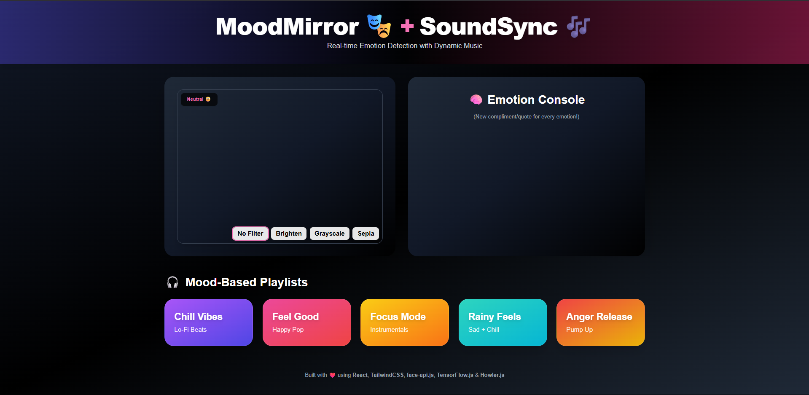
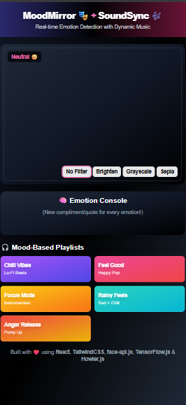
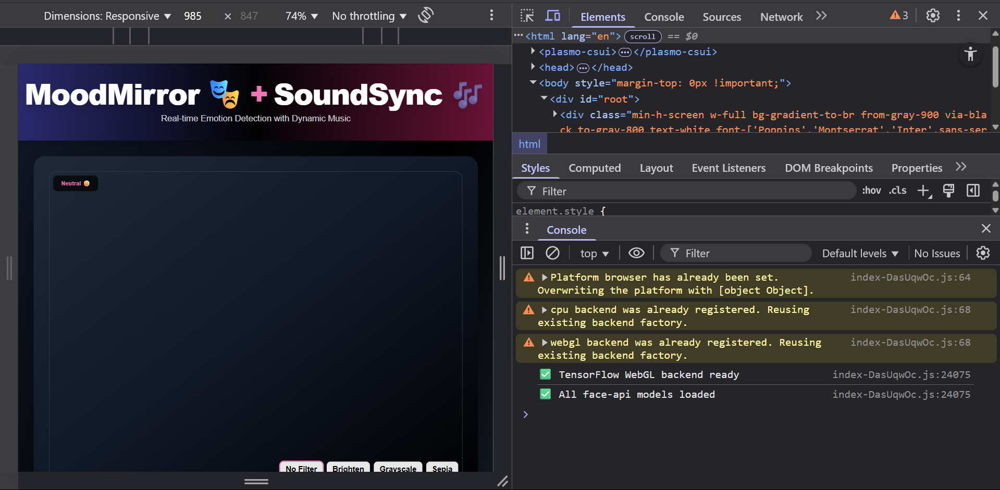

# MoodMirror 🎭 + SoundSync 🎶

A modern, AI-powered web app that detects your facial emotion in real time and syncs it with mood-based music playlists. Built with React, Vite, face-api.js, TensorFlow.js, Howler.js, and Tailwind CSS.

---

## 🚀 Live Demo
[View the deployed app on Vercel](https://emotion-detector-xux4.vercel.app/)

---

## 📸 Screenshots
> _App screenshots for a complete showcase._

### **Desktop View**

*Shows the full app layout on a desktop screen, including webcam, emotion console, music controls, and playlist cards.*

### **Mobile View**

*Demonstrates the responsive design and usability on a mobile device.*

### **Mood-Based Playlist Section**

*Highlights the colored playlist cards and their responsive stacking.*

### **Emotion Console & Compliments**

*Displays the dynamic compliment/quote and detected emotion on a smaller screen.*

### **Music Controls**

*Shows the play, pause, volume, and now playing info below the emotion console (see desktop view).*

### **Cursor/Chat Features**
<!-- Add a screenshot here if/when you have chat/cursor features -->

---

## 📖 Overview
MoodMirror + SoundSync is a web application that:
- Uses your webcam to detect your facial emotion in real time (happy, sad, angry, neutral, etc.)
- Plays a short sound cue for each detected emotion
- Shows a dynamic compliment or quote for your mood
- Lets you play mood-based playlists (with music controls)
- Features a beautiful, responsive, mobile-friendly UI

---

## ✨ Features
- **Real-time emotion detection** using face-api.js and TensorFlow.js
- **Mood-based music playlists**: Hindi/royalty-free demo songs for each emotion
- **Music controls**: Play, pause, volume, now playing info
- **Short emotion sound cues** (auto-stop after 5s)
- **Dynamic compliments/quotes** for each emotion
- **Beauty/camera filters** for webcam feed
- **No face detected** message for user feedback
- **Responsive design**: Works on mobile, tablet, and desktop
- **Modern UI**: Tailwind CSS, Google Fonts, beautiful gradients
- **Collaborative chat/cursor features** (if enabled)

---

## 🛠️ How it Works
1. **Model Loading**: Loads face-api.js models from `/public/models`.
2. **Webcam Feed**: Uses your webcam (with permission) for live video.
3. **Emotion Detection**: Analyzes your face every second and detects the dominant emotion.
4. **Sound Cue**: Plays a short sound for each new emotion (auto-stops after 5s).
5. **Playlist**: Shows mood-based playlists. Clicking a card plays a random song for that mood.
6. **Music Controls**: Control playback and volume below the emotion console.
7. **Chat/Cursor**: (If enabled) Allows collaborative interaction or chat with other users.

---

## 🧑‍💻 Getting Started

### 1. Clone the Repository
```sh
git clone https://github.com/your-username/facial-emotion-player.git
cd facial-emotion-player
```

### 2. Install Dependencies
```sh
npm install
```

### 3. Start the Development Server
```sh
npm run dev
```

### 4. Open in Your Browser
Go to [http://localhost:5173](http://localhost:5173)

---

## 🌐 Deployment
- **Vercel** (recommended):
  - Connect your GitHub repo to Vercel
  - Set build command: `npm run build`
  - Set output directory: `dist`
- **Netlify**:
  - Connect your GitHub repo to Netlify
  - Set build command: `npm run build`
  - Set publish directory: `dist`

---

## ⚠️ Limitations
- **Emotion detection accuracy** depends on lighting, camera quality, and face visibility.
- **Song URLs** are demo/royalty-free; you can replace them with your own.
- **Browser autoplay policy**: Some browsers may block auto-playing audio until user interacts.
- **Model size**: Initial load may take a few seconds due to face-api.js models.

---

## 💡 Opportunities for Improvement
- Add more moods/emotions and custom playlists
- Allow users to upload their own songs/playlists
- Add GIFs or images to the emotion console
- Support for multiple languages
- PWA/mobile app version
- More advanced beauty/camera filters
- User authentication and mood history
- Enhance collaborative chat/cursor features

---

## 🤝 Open Source & Contributions
- **Contributions are welcome!**
- Please open issues or pull requests for bugs, features, or improvements.
- Follow the [Contributor Covenant](https://www.contributor-covenant.org/) code of conduct.

---

## 📝 Credits & Technology
- [React](https://react.dev/)
- [Vite](https://vitejs.dev/)
- [face-api.js](https://github.com/justadudewhohacks/face-api.js)
- [TensorFlow.js](https://www.tensorflow.org/js)
- [Howler.js](https://howlerjs.com/)
- [Tailwind CSS](https://tailwindcss.com/)
- [SoundHelix](https://www.soundhelix.com/) (demo music)
- [Google Fonts](https://fonts.google.com/)

---

## 📬 Contact
- Created by [Aniket Shinde](https://github.com/AniketShinde02)
- For questions, open an issue or contact via GitHub
-  Mail at shindeaniket085@gmail.com
